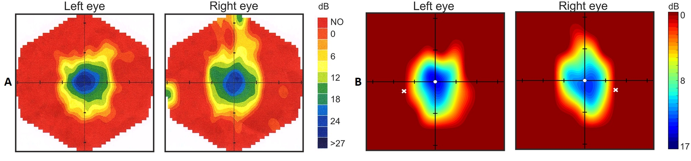

<!-- http://piotrdzwiniel.github.io/Specvis-Desktop/ -->

<h2>Contents</h2>
<ol>
    <li><a href="#About">About</a></li>
    <li><a href="#Requirements">Requirements</a></li>
    <li><a href="#Download">Download</a></li>
    <li><a href="#QuickStart">Quick Start</a></li>
        <ul>
            <li><a href="#Launch">Launch</a></li>
            <li><a href="#PerformingVisualFieldTest">Performing Visual Field Test</a></li>
            <li><a href="#Documentation">Documentation</a></li>
        </ul>
    <li><a href="#AcademicalValidation">Academical Validation</a></li>
    <li><a href="#CiteSpecvis">Cite Specvis</a></li>
    <li><a href="#License">License</a></li>
    <li><a href="#Support">Support</a></li>
    <li><a href="#Contribute">Contribute</a></li>
    <li><a href="#KnownIssues">Known Issues (FAQ)</a></li>
    <li><a href="#UpcomingChanges">Upcoming Changes & Improvements</a></li>
    <li><a href="#Donate">Donate</a></li>
    <li><a href="#Contact">Contact</a></li>
</ol>

<h2 id="About">About</h2>

Specvis Desktop is a free, open-source and <a href="#AcademicalValidation">academically verified</a> software for visual field examination using <a href="https://en.wikipedia.org/wiki/Visual_field_test#Static_perimetry">static perimetry</a>, which consists of displaying visual stimuli in various places on the screen in the form of points of different brightness, to which the subject responds when he sees them. As a result, we obtain a visual field sensitivity map based on the basis of which we can conclude about its condition. <b>Specvis Desktop has very low hardware requirements and can be launched on any today laptop computer.</b>

<b>Figure.</b> Visual field graphical maps from <a href="https://en.wikipedia.org/wiki/Retinitis_pigmentosa">retinitis pigmentosa</a> patient. <b>A.</b> The results from Medmont M700 professional perimeter. <b>B.</b> The results from Specvis Desktop application.

<h2 id="Requirements">Requirements</h2>

In order to ensure the multiplatformity of the application (which runs on Windows, Linux, and Mac), it was written in the Java programming language. This means that the application needs Java Runtime Environment (JRE; platform for running Java applications) to be installed on your computer to run. That said you need specifally JRE in version 8.121 or above, but not 10 and above due to the fact, that Specvis Desktop uses JavaFX for which Oracle (a company that officially develops Java) stopped its support starting with JRE 10. Nevertheless, if you must use JRE 10 or above, you can find installing <a href="https://openjfx.io/">openjfx</a> as a solution to your possible problem with running Specvis Desktop. You just have to point to the openjfx directly and add required modules when launching Specvis Desktop from the command prompt by typing for example: <code>java --module-path openjfx/lib --add-modules javafx.controls,javafx.fxml -jar Specvis.jar</code> But I strongly suggest to stick to the JRE 8.121 if possible. You can check whether your computer has an appropriate JRE version by typing <code>java -version</code> in the command prompt. You can download a specific JRE version <a href="http://www.oracle.com/technetwork/java/javase/downloads/index.html">here</a>.

<h2 id="Download">Download</h2>

You can download Specvis Desktop as a <a href="https://github.com/piotrdzwiniel/Specvis/raw/master/latest_build/Specvis_v1_1_1/Specvis.zip">*.zip</a> or <a href="https://github.com/piotrdzwiniel/Specvis/raw/master/latest_build/Specvis_v1_1_1/Specvis.tar.gz">*.tar.gz</a>. After downlod unpack the archive in a desired location. The content of the unpacked archive should contain <code>Specvis.jar</code> file. You will use this file to launch Specvis application.

<h2 id="QuickStart">Quick Start</h2>
<h4 id="Launch">Launch</h4>

In order to launch Specvis Desktop double click on the <code>Specvis.jar</code> file or tye <code>java -jar Specvis.jar</code> in the command prompt, remembering, that you have to include Specvis directory in the command you want to execute or while being in the appropriate directory from the level of the command prompt.

<h4 id="PerformingVisualFieldTest">Performing Visual Field Test</h4>

First, add new or choose an existing patient in the Specvis Desktop window. Second, choose which eye you want to test. Third, select one of the predefined settins templates or choose testing settings by your own. Fourth, conduct the visual field test.

<h4 id="Documentation">Documentation</h4>

For more detailed information about all Specvis Desktop functionalities look into its <a href="documentation_2022_01_02.pdf" target="_blank">documentation</a>.

<h2 id="AcademicalValidation">Academical Validation</h2>

Specvis Desktop was tested on glaucomatous, retinitis pigmentosa and stroke patients and the results were compared to results using the Medmont M700 Automated Static Perimeter, which is a commercially available, certified medical equipment used widely in different ophthalmology offices around the world. The application was also tested for inter-test intrapersonal variability. The results from both validation studies indicated low inter-test intrapersonal variability, and suitable reliability for a fast and simple assessment of visual field impairement. Specvis easily identifies visual field areas of zero sensitivity and allows for evaluation of its levels throughout the visual field. Thus, Specvis is a new, reliable application that can be successfully used for visual field examination and can fill the gap between confrontation and perimetry tests.
    
The software itself and corresponding validation studies were thoroughly described in the article <a href="https://journals.plos.org/plosone/article?id=10.1371/journal.pone.0186224">Specvis: Free and open-source software for visual field examination</a> published in PLoS ONE scientific journal.

<h2 id="CiteSpecvis">Cite Specvis</h2>

    If you use Specvis in your research that will be described in a scientific journal, please cite         Specvis Desktop by referring to the following citation:
    <ul>
        <li>Dzwiniel P, Gola M, Wójcik-Gryciuk A, Waleszczyk WJ (2017) Specvis: Free and open-source
        software for visual field examination. PLoS ONE 12 (10): e0186224.
        <a href="http://journals.plos.org/plosone/article?id=10.1371/journal.pone.0186224">
        https://doi.org/10.1371/journal.pone.0186224</a>.</li>
    </ul>

<h2 id="License">License</h2>

Specvis Desktop is currently licensed under <a href="https://en.wikipedia.org/wiki/GNU_General_Public_License#Version_3">GNU GPLv3</a> but it can change for its future, upcoming versions. However, future versions of Specvis Desktop will always include the basic functionality to reliably evaluate the field of view for free. Accesibility of the application was my main idea when creating it, so I can asure you, that it will not change in the future.

<h2 id="Support">Support</h2>

If there is any technical problem with Specvis, please go to <a href="https://github.com/piotrdzwiniel/Specvis/issues">the issues section</a> and try to look for the solution to your problem among existing topics. If you can't find the solution, than create a new issue and describe your problem as accurate as it is possible. If something is not working in Specvis (it freezes, behave oddly etc.), than try to run it from the command prompt and than try to force this situation when something is not working. If any error will appear in the command prompt, copy it and include it in the description of the issue. Remember, the more information you'll provide about the problem you've encountered using Specvis, the bigger chance that this problem will be solved and will not occur any more.

<h2 id="Contribute">Contribute</h2>

If you have an idea how Specvis Desktop can be improved, for example what new functionalities can be introduced to its future versions, please don't hesitate to <a href="#Contact">contact me</a>. Remember, that Specvis Desktop aims to be a vision diagnostic software tool.

<h2 id="KnownIssues">Known Issues (FAQ)</h2>

<ul>
    <li><b>Problem:</b> Specvis Desktop is not running when double clicked on <code>Specvis.jar</code></li>
    <ul>
    <li><i>Explanation:</i> The most plausible explanation to this problem is that you try to run Specvis Desktop from the location where you need to have administrative permissions. For example, if you downloaded Specvis Desktop on your main drive/partition (most likely "C") which is also a drive with an operating system installed on it and drive/partition is protected with administrative permissions then running Specvis Desktop by simply double clicking on it can be impossible.</li>
    <li><i>Solution:</i> If you want to keep Specvis Desktop on a restricted drive/partition, then you can run the application via command prompt. However, commant prompt should be launched with the use of "run as the administrator" mode. Other, simpler solution to the problem, is to just place Specvis Desktop folder in a location, where any administrative permissions are not required for the user.</li>
    </ul>
</ul>

<ul>
    <li><b>Problem:</b> Issues with launching/running Specvis Desktop using JRE in higher versions then 8u121</li>
    <ul>
        <li><i>Explanation:</i> You can face some problems while trying to launch/run Specvis Desktop using JRE in version 11 or higher. It's due to the fact that Specvis Desktop uses JavaFX library for which Oracle (official developer of the Java programming language) made it open sourced from JRE 11 and later releases, thus stopped official support of it with their runtime environments.</li>
        <li><i>Solution:</i> If you want to use newer version of JRE you can supplement lack of the official JavaFX library support by installing <a href="https://openjfx.io/">openjfx</a> library. When installation is completed you just have to point to an appropriate jfx modules while running Specvis Desktop (using command prompt is required) <code>java --module-path path1/openjfx/lib --add-modules javafx.controls,javafx.fxml -jar path2/Specvis.jar</code>. Remember, that <code>path1</code> and <code>path2</code> has to point to direct paths to openjfx folder and Specvis Desktop folder, respectively. However, if possible, it is recommended to use specifically JRE in version 8u121.</li>
    </ul>
</ul>

<ul>
    <li><b>Problem:</b> Despite changing the settings, Specvis Desktop behaves as if the settings have not been changed.</li>
    <ul>
        <li><i>Explanation:</i> Specvis Desktop uses few input fields for numerical values where you can type arbitraty input by yourself. However, Specvis Desktop will not save automatically provided value unless you will "accept" provided value.</li>
        <li><i>Solution:</i> When changing settings with the use of input fields make sure that you hit ENTER after typing a desired value in the field.</li>
    </ul>
</ul>

<ul>
    <li><b>Problem:</b> Visual field examination procedure is interrupted by Specvis Desktop crash/error.</li>
    <ul>
        <li><i>Explanation:</i> There are situations when Specvis Desktop visual field examination procedure can be interrupted or it can crash. The result of such crash is: 1) freeze of the procedure or 2) visual field graphical map indicating that no responses were provided by the patient during the test.</li>
        <li><i>Solution:</i> Make sure, that all settings numerical inputs you provide are confirmed by hitting ENTER key on your keyboard. If problem persists, do not use any of the available fixation (gaze) monitor techniques.</li>
    </ul>
</ul>

<ul>
    <li><b>Problem:</b> Specvis Desktop freezes during the attempt to redraw visual field graphical map.</li>
    <ul>
        <li><i>Explanation:</i> Specvis Desktop uses pretty complicated computation to create visual field graphical map based on the results from the test. Thus, it takes time, to redraw the map after changing isofactor and interpolation values, whereas time it takes depends on the hardware configuration you are using (computational power). The lower the isofactor value and the higher the interpolation value, the longer time needed for the computations standing behind redraw function.</li>
        <li><i>Solution:</i> Wait. Specvis Desktop thinks. You can also use higher isofactor and lower interpolation values in order to decrease time needed for redrawing the visual field graphical map.</li>
    </ul>
</ul>

<h2 id="UpcomingChanges">Upcoming Changes & Improvements</h2>

<ol>
    <li><b>Rebuild of the existing graphical user interface (GUI).</b> Creation of a "traditional" GUI with resizable main window, menu bar with access to all application's functionalities, and possibility to arange main window with subwindows with desired functionalities (e.g. preview of the ongoing diagnostic test, patient's information, recommendations etc.).</li>
    <li><b>Printout with the results.</b> Implementing a function allowing generation of printouts with the results from the vision diagnostic test in a form of *.pdf that can be previewed, saved, and/or printed. Printouts will look like and contain data similarly to the existing, commercial solutions, thus they will be easily comparable with the results obtained with other devices and easily interpretable by clinicians.</li>
    <li><b>Improvements of the visual field examination.</b></li>
    <ul>
        <li>Recording of the patient's response times to the displayed visual stimuli.</li>
        <li>Clinical-like way of presenting the examination results similar to those present in commercial solution/devices.</li>
        <li>Possibility of comparing the obtained results to the population mean. The database standing behind the mean results will be successively enlarged with time and in future also include results for patient's with various vision deficits, e.g. glaucoma, retinitis pigmentosa, hemianopia etc.</li>
        <li>Using Heijl-Krakau technique for monitoring patient's fixation (gaze) during the test.</li>
        <li>Using computer's front camera for recognizing pupillary's position and using it to monitor patient's fixation (gaze) during the test.</li>
        <li>Organizing visual field diagnosis functionality in three main test types.</li>
        <ul>
            <li><i>Fast.</i> Visual field examination with test duration in mind. Procedure will take around 4-8 minutes per eye. Examination pattern: 30-2. Stimulus size: Goldmann III. Stimulus display time: 200 ms. Stimulus colour: white. Inter-stimulus interval: 800 ms. Fixation point size: Goldmann III. Fixation point colour: white. Fixation point location: centre. Background colour: black. Examination strategy: top, dynamic. Monitoring fixation: Heijl-Krakau.</li>
            <li><i>Accurate.</i> Visual field examination with test accuracy in mind. Procedure will take around 8-12 minutes per eye. Examination pattern: 30-2 + 10-2. Stimulus size: Goldmann III. Stimulus display time: 200 ms. Stimulus colour: white. Inter-stimulus interval: 800 ms. Fixation point size: Goldmann III. Fixation point colour: white. Fixation point location: centre.  Background colour: black. Examination strategy: dynamic, normal. Monitoring fixation: Heil-Krakau or Heil-Krakau + Camera.</li>
            <li><i>Custom.</i> Visual field examination extensively customizable by the user, where it will have the possibility to change: stimulus size (Goldmann I, II, III, IV, V, custom in degrees), stimulus display time, inter-stimulus interval, fixation point size, fixation point colour, fixation point location, background colour, examination pattern (10-1/2, 24-1/2, 30-1/2, combination of mentioned patterns, custom pattern), examination strategy (top, dynamic, low vision, normal), metrics that will be included in the printout with the results.</li>
        </ul>
    </ul>
    <li><b>New vision diagnostic tools.</b> </li>
    <ul>
        <li>Colour vision diagnosis.</li>
        <li>Visual acuity diagnosis.</li>
    </ul>
    <li><b>Database with basic knowledge about vision, its hygiene, prevention, and diagnosis.</b> Specvis Desktop is aiming mostly at clinicians and academics. However, around 20% of users described themselves as "patients". Thus, assuming that there is a high potential for self-diagnosis with the use of Specvis Desktop it is important to focus on the education about vision and its diagnosis as well.</li>
    <li><b>Automation of diagnostic inference with the use of machine learning techniques.</b> With the use of academically verified diagnostic solutions based on machine learning principles Specvis Desktop will allow automatic, early diagnosis of the most common visual deficits, such as glaucoma. Patients who perform tests by themselves will get information about the need to contact or visit with a ophthalmologist if such deficit will be recognized.</li>
    <li><b>Telemedicine solutions.</b> Taking into account rapid development of various digital technologie Specvis Desktop will offer solutions from the field of telemedicine and self-diagnosis allowing patients to perform tests in their home and contact with ophthalmologists remotely via internet.</li>
    <li><b>Preparation of the application installer in order to make the process of launching Specvis Desktop for the first time easier fot the end user.</b> Knowing, that current way of dealing with Specvis Desktop files is a little bit tricky and it can be of some problems for users, Specvis Desktop will allow installation on the Windows computers as any other applications you install on your machine.</li>
</ol>

<h2 id="Donate">Donate</h2>

Specvis Desktop is a free and open-source application for visual field examination developed by one person pro publico bono (for free) aiming mostly at developing regions of the World where access to a professional ophthalmic healthcare is very problematic. Taking into account that I want to retain free access to the application as long as it's possible and to keep working on its future versions I would be very grateful if you consider helping in Specvis Desktop development by providing a donation to it.

<b>Donations are realized and protected by <a href="https://stripe.com/">Stripe</a>, thus their are totally safe. You can also repeat donations as often, as you will find it appropriate.</b>

Thank you very much for your support!

<button class="button" onclick="window.open('https://buy.stripe.com/dR616276d5GBa7m288', '_blank')">€5.00 EUR</button>
<button class="button" onclick="window.open('https://buy.stripe.com/00g5micqx3yt3IY9AB', '_blank')">€10.00 EUR</button>
<button class="button" onclick="window.open('https://buy.stripe.com/dR67uq9el1ql7Ze28a', '_blank')">€25.00 EUR</button>
<button class="button" onclick="window.open('https://buy.stripe.com/8wM7uqbmt4Cx7Ze7sv', '_blank')">€50.00 EUR</button>
<button class="button" onclick="window.open('https://buy.stripe.com/7sIbKGduBfhb2EU9AE', '_blank')">€100.00 EUR</button>

<h2 id="Contact">Contact</h2>

In any matter please write at <b>specvis.desktop@gmail.com</b>.

